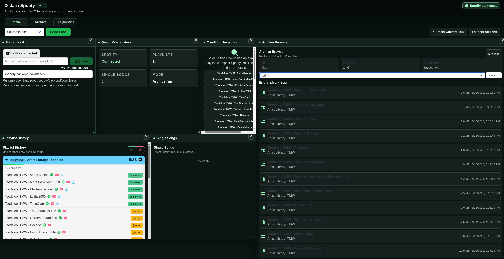

# Jarri Spooty

Deterministic media ingestion workspace for Spotify metadata and YouTube archival.

Spooty does not download audio from Spotify itself.
It retrieves metadata from Spotify and locates matching audio on YouTube.

Deterministic Spotify metadata ingestion with duration-aware YouTube candidate scoring, paced queue execution, hardened Docker deployment, and local archival workflows.

Current version: 3.0.0

This hardened branch focuses on:

- ChronoGit-style Workspace UI panels
- Large playlist support (>100 tracks)
- Spotify OAuth login flow
- Better YouTube pacing and throttling resistance
- Improved Docker deployment
- Safer credential handling
- More resilient cover-art embedding
- Better queue stability
- Deterministic YouTube fallback handling
- Explicit yt-dlp CLI execution
- Automatic failed-candidate rejection
- Improved age-gated video handling
- Persistent SQLite state across container restarts
- Deterministic Docker config persistence
- Improved operational observability
- Reduced unused dependency surface
- Hardened filename, cover-art, subprocess, and websocket boundaries
- Workspace Archive Browser MVP with scoped read-only archive listing
- Workspace Candidate Inspector MVP for selected track details
- Frontend archive destination field for planned per-run routing
- Frontend Workspace tabs for Intake, Archive, and Diagnostics layouts

---

# Features

- Download Spotify playlists
- Download individual Spotify tracks
- Playlist auto-subscription support
- Automatic YouTube matching
- MP3 tagging and embedded cover art
- Docker deployment
- Queue-based download system
- Spotify OAuth integration
- Large playlist pagination support
- Download pacing controls
- YouTube cookie support
- Automatic YouTube retry/fallback handling
- Failed YouTube candidate rejection memory
- Deterministic yt-dlp error classification
- Hardened cover-art validation and embedding
- Explicit client-facing websocket payload shaping
- Draggable/resizable Workspace UI
- Archive Browser panel for downloaded file inspection
- Candidate Inspector panel for selected track diagnostics
- Frontend-persisted archive destination input
- Per-tab workspace layout presets
- Read-only archive search, sort, and grouped file inspection

---

# Workspace UI

Jarri Spooty 3.0.0 introduces a draggable/resizable Workspace shell with frontend tab presets.

Workspace tabs:

- Intake
- Archive
- Diagnostics

Each tab has its own persisted panel layout in browser localStorage. The old single workspace layout is migrated into the Intake tab when possible. The current tab can be reset independently, and all tabs can be reset together.

Workspace panels:

- Source Intake: Spotify connection, URL queueing, and a frontend-persisted Archive destination field
- Queue Observatory: Spotify, playlist, single-song, and archive-run metrics
- Playlist History: existing playlist rows and delete completed/delete failed controls
- Single Songs: existing single-track queue rows
- Archive Browser: read-only browser-style listing of downloaded files inside the configured downloads root, with search, sort, file count, total size, and top-level folder grouping
- Candidate Inspector: selected track details including Spotify URL, selected YouTube candidate, status, error, retry attempts, rejected candidates when available, and a Back/Clear selection action

The Archive destination field is frontend-persisted planning state. Runtime downloads still use the backend `DOWNLOADS_PATH` root. Per-run destination routing is pending backend support.

The Archive Browser uses:

    GET /api/archive

It returns the configured downloads root and files under that root only. It does not allow arbitrary filesystem browsing, deletion, moving, renaming, or path traversal.

Candidate alternatives are limited to the selected YouTube URL and rejected YouTube URLs already stored for the track. Full scoring history is not persisted yet.

---

# Important Notice

Use this software responsibly.

Only download music you legally own or are permitted to access.

The maintainers are not responsible for misuse.

---

# Supported URLs

- Spotify playlists
- Spotify tracks

Example:

    https://open.spotify.com/playlist/...
    https://open.spotify.com/track/...

---

# Quick Start (Recommended)

## 1. Create Spotify Developer App

Go to:

    https://developer.spotify.com/dashboard

Create an application.

Add this Redirect URI:

    http://127.0.0.1:3000/api/spotify/callback

Copy:

- Client ID
- Client Secret

---

## 2. Store Credentials Outside Repository

Create a secure env file:

~~~bash
sudo mkdir -p /etc/tokens

sudo tee /etc/tokens/spotify.env > /dev/null <<'EOT'
SPOTIFY_CLIENT_ID=your_client_id
SPOTIFY_CLIENT_SECRET=your_client_secret
EOT

sudo chown root:$USER /etc/tokens/spotify.env
sudo chmod 640 /etc/tokens/spotify.env
~~~

Never commit this file.

---

## 3. Export YouTube Cookies (Recommended)

YouTube increasingly rate-limits or age-gates anonymous downloads.

Export a Netscape-format `cookies.txt` from a logged-in browser session.

Recommended storage:

~~~bash
sudo cp cookies.txt /etc/tokens/youtube.cookies.txt
sudo chown root:$USER /etc/tokens/youtube.cookies.txt
sudo chmod 640 /etc/tokens/youtube.cookies.txt
~~~

---

# Docker Run

~~~bash
docker run --rm -p 3000:3000 \
  --env-file /etc/tokens/spotify.env \
  -e SPOTIFY_REDIRECT_URI='http://127.0.0.1:3000/api/spotify/callback' \
  -e AUTH_ENABLED=true \
  -e SPOOTY_AUTH_TOKEN=change_this_token \
  -e YT_SEARCH_DELAY_MS=7000 \
  -e YT_DOWNLOADS_PER_MINUTE=6 \
  -e YT_COOKIES_FILE=/spooty/config/youtube.cookies.txt \
  -v "$PWD/downloads:/spooty/backend/downloads" \
  -v "$PWD/spooty-config:/spooty/backend/config" \
  -v "/etc/tokens/youtube.cookies.txt:/spooty/config/youtube.cookies.txt:ro" \
  jarri-spooty:local
~~~

Open:

    http://127.0.0.1:3000/?token=change_this_token

Then:

1. Click "Connect Spotify"
2. Login to Spotify
3. Approve access
4. Paste playlist URL
5. Download

---

# Deterministic YouTube Fallback Handling

The hardened branch now uses direct `yt-dlp` CLI execution rather than relying entirely on wrapper abstractions.

This provides:

- Explicit stderr visibility
- Better Docker compatibility
- Deterministic retry handling
- Automatic failed-candidate rejection
- Better age-gated video handling
- Improved operational observability

If a YouTube candidate fails:

1. The failed URL is recorded
2. The candidate is rejected
3. A new YouTube search is performed
4. The next-best valid candidate is attempted automatically

This prevents infinite retry loops against dead or restricted videos.

---

# Queue Pacing

Aggressive YouTube access can trigger:

- HTTP 302 loops
- CAPTCHA
- temporary throttling
- incomplete downloads

Recommended safe pacing:

~~~bash
-e YT_SEARCH_DELAY_MS=7000
-e YT_DOWNLOADS_PER_MINUTE=6
~~~

The hardened branch also includes additional internal pacing and retry coordination to reduce:

- repeated failed candidate loops
- aggressive retry bursts
- queue collisions
- YouTube anti-bot triggers

---

# Security Notes

Never commit:

- Spotify secrets
- OAuth tokens
- cookies.txt
- downloaded music
- local databases
- spooty-config/

Recommended `.gitignore` additions:

~~~gitignore
downloads/
config/
spooty-config/
*.sqlite
cookies.txt
.env
.env.local
~~~

---

# License

MIT
